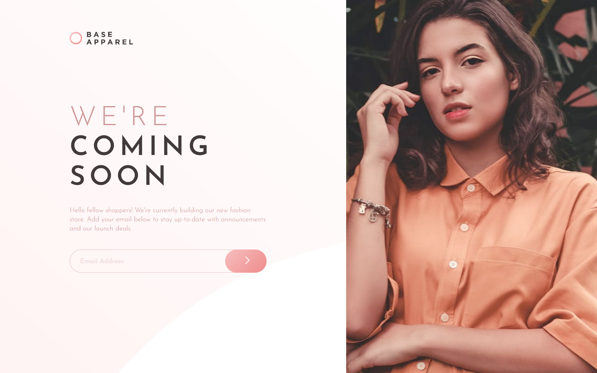

# Frontend Mentor - Base Apparel coming soon page solution

This is a solution to the [Base Apparel coming soon page challenge on Frontend Mentor](https://www.frontendmentor.io/challenges/base-apparel-coming-soon-page-5d46b47f8db8a7063f9331a0). Frontend Mentor challenges help you improve your coding skills by building realistic projects. 

## Table of contents

- [Overview](#overview)
  - [The challenge](#the-challenge)
  - [Screenshot](#screenshot)
  - [Links](#links)
- [My process](#my-process)
  - [Built with](#built-with)
  - [What I learned](#what-i-learned)
  - [Continued development](#continued-development)
- [Author](#author)

## Overview

### The challenge

Users should be able to:

- View the optimal layout for the site depending on their device's screen size
- See hover states for all interactive elements on the page
- Receive an error message when the `form` is submitted if:
  - The `input` field is empty
  - The email address is not formatted correctly

### Screenshot



### Links

- [See the solution](https://your-solution-url.com)
- [View live site](https://base-apparel-coming-soon-indol.vercel.app/)

## My process

### Built with

- Semantic HTML5 markup
- SCSS
- Custom styling
- BEM methodology
- Mobile-first workflow
- Vanilla JavaScript

### What I learned

Although this solution does not use CSS grid, I learnt quite a lot about it in the process of creating it. I initially intended to use grid to position elements in desktop layouts in this challenge, however to be able to achieve this, I had to modify my markup and pull the image container out of the `<main>` element. I considered using the `<aside>` tag as the container then, but decided against it - as it has no content, I think it wouldn't be a great choice when it comes to accessibility.

I finally decided to simply position the image absolutely and set use vw to set its width - I think it's the simplest solution here.

I also use vw as the unit to set the height of the image in mobile layout to ensure good balance of elements in the viewport, as well as to set font-sizes and line-heights on largest screens. I did not want to stick to rem as this would create a lot of empty space in the middle of the screen on largest viewports.

```scss
.signup__heading {
    margin-bottom: 1rem;
    font-size: 2.5rem;
    line-height: 2.625rem;
    font-weight: $light;
    color: $main-text;
    text-transform: uppercase;
    letter-spacing: 0.625rem;

    @include breakpoint-up(xlarge) {
        max-width: 30vw;
        font-size: 4.5vw;
        line-height: 5vw;
    }
}
```

### Continued development

I want to continue learning and perfecting my CSS grid understanding and skills.

## Author

- Frontend Mentor - [@AgataLiberska](https://www.frontendmentor.io/profile/AgataLiberska)
